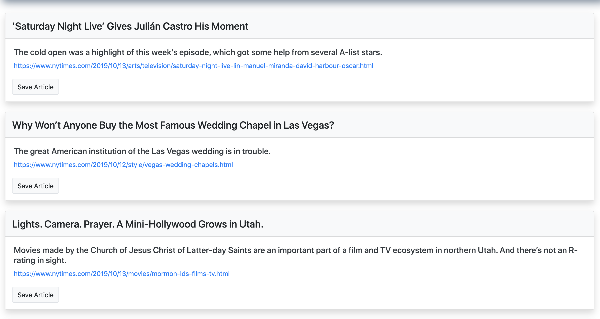

# article-scraper (New York Times Edition)

**Article-Scraper** is an article scraper that scrapes stories from a news outlet (New York Times), save each scraped article to mongo database, and display headline(title), summary, and URL of the articles for the user. Users can also save article of their choice and leave comments on the saved article. The comments are also saved to the database as well and assicoated with their articles. App uses Axios and Cheerio to scrape news article from the NYTimes website.

## Getting Started

- Clone down repo.
- Node.js - Download the latest version of Node https://nodejs.org/en/
- Run command 'npm install' in Terminal or GitBash to install npm package dependencies needed for this app.
- run mongod in Terminal or GitBash to start Mongo server

## Deployed Website
**Article-Scraper** is deployed to Heroku. [Here](https://article-scraper-nytimes.herokuapp.com/) is the link to the deployed site.

## How to Use
To use our article scraper, go to our [Website](https://article-scraper-nytimes.herokuapp.com/).
**To scrape new articles:** 
  - Click `Scrape New Articles!` button.
**To save a scraped article**
  - Click on `Save Article` button on the article you wish to save.
**To view saved articles**
  - Click on the `Saved Articles` link on the top navbar
**To remove a saved article**
  - Click on the `Delete Article` button located at the bottom left corner of the saved articles.
**To leave a comment on a saved article**
  - Click on the `Article Notes` button located at the bottom left corner of the saved articles.
  - Write note on the textbox in the modal that popup after clicking on the `Article Notes` button.
  - Click `Save Note` button to save the note.
**To removed a note on a saved article**
  - Click on the `Article Notes` button located at the bottom left corner of the saved articles to view the notes.
  - Click on the `x` Button of the notes you wish to remove

### Homepage

## Tech used
- Bootstrap
- Bootbox
- Axios
- Cheerio
- Handlebars
- JavaScript
- JQuery
- Node.js
- Mongodb
- Mongoose
- Express - https://expressjs.com/
- Express NPM Package- https://www.npmjs.com/package/express
- Heroku - https://www.heroku.com
- .gitignore - to tell git not to track files such as node_modules thus they won't be committed to Github.

## Authors

* **Youngwoo Cho** - * Node JS / Express / Mongodb / Mongoose /  Handlebars / * - [Youngwoo Cho](https://github.com/catnap89)